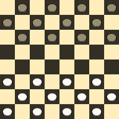

# Developer / Research Engineer Challenge

**IMPORTANT**: Before starting this challenge, make sure we have a position by sending your
resume and cover letter to founders@deepomatic.com.

Please use [this link](https://github.com/Deepomatic/challenge/archive/master.zip) to download the source code and do not fork the repository. Please also read all the instructions carefully. Feel free to send any question to vincent@deepomatic.com.

Checkers is a popular 2 player board game where the opponent discs are captured by jumping over them. The objective of the game is to capture all the opponent's discs or leave him with no valid moves left to make.

The game takes place on an 8 * 8 chess board as shown below.



Each player occupies one of the 2 sides of the chess board where the discs are placed. Black goes first.

## Rules
**WARNING**: please read carefully even if you think that you know the rules. Those are *english* rules. Those are simpler: in a nutshell, a disc can only go forward even when capturing and a King can move in any direction but capture only nearby opponent discs (or move on nearby squares).

- Each player begins with 12 colored discs as depicted in the previous image.
- The discs are positioned such that each player has a light square on the right side corner closest to him or her.
- Black moves first and players alternate henceforth.
- Moves are allowed only on the dark squares, so the discs always move diagonally. Regular discs are limited to forward moves (toward the opponent). Kings (see the last rule) can also move backward.
- There are 2 kinds of moves: **Capturing** and **Non-Capturing** moves.
- **Non-Capturing** moves may move only one square in diagonal to a vacant position.
- If more than 1 **Non-Capturing** moves exist, any of the moves can be played.
- A disc making a **Capturing** move leaps over one of the opponent's discs that is 1 square away from itself and lands in a straight diagonal line, which is 2 squares away from itself. A jump can make only 1 capture, but the same disc can capture multiple opponent discs by doing multiple jumps in a single move. **A disc can only make forward capturing moves** (english rules).
- A captured disc is removed from the board.
- If a **Capturing** move exists, the jump has to be made. If more than one capture exists, a choice can be made among **Capturing** moves.
- A disc reaching the opponent's side of the board is crowned as a King. King's move is similar to that of a regular disc's move but the restriction of forward only moves is lifted. Multiple King's may exist. When a disc reaches the opponent's side while capturing, **it is promoted King during the move and can continue to capture backwards during the same move. In some cases, a King can even go through the initial position it had when starting a capturing move**.

## Requirements

You will need Python 2.7+ for this project and a working **make**.

You are free to add any library you might consider useful, but in that case, please use ```virtualenv``` to isolate those libraries from the ones of your system:

```
$ virtualenv .venv
$ source .venv/bin/activate
$ pip install -r requirements.txt
```

You will need to run the following command each time you start a new shell session (see [virtualenv documentation](https://virtualenv.pypa.io/en/stable/userguide/) for more information):

```
$ source .venv/bin/activate
```

## Goal

The candidate is invited to first fill the function ```allowed_moves``` in the file ```ai.py```.

**Arguments**:

This function takes two arguments:
- ```board```: The content of the board, represented as a list of strings. The length of strings are the same as the length of the list, which represents a NxN checkers board. Each string is a row, from the top row (the black side) to the bottom row (white side). The string are made of five possible characters:
    - ```'_'``` : an empty square
    - ```'b'``` : a square with a black disc
    - ```'B'``` : a square with a black king
    - ```'w'``` : a square with a white disc
    - ```'W'``` : a square with a white king
- color: the next player's color. It can be either ```'b'``` for black or ```'w'``` for white.

**Output**:

The function ```allowed_moves``` must return a list of all the valid moves according to the previously described rules. A move is a list of all the squares visited by a disc or a king, from its initial position to its final position. The coordinates of the square must be specified by a tuple ```(row, column)```, with both ```row``` and ```column``` starting from 0 at the top left corner of the board (black side).

**Example 1**:

```python
>> board = [
    '________',
    '__b_____',
    '_w_w____',
    '________',
    '_w______',
    '_____b__',
    '____w___',
    '___w____'
]
>> allowed_moves(board, 'b')
[
    [(1, 2), (3, 0), (5, 2)],
    [(1, 2), (3, 4)]
]
```

In the previous example, the top-most black disc can chain two jumps and eat both left white
discs or jump only over the right white disc. The other black disc cannot move because it does produces any capturing move.

If black decides to play the first proposed move ```[(1, 2), (3, 0), (5, 2)]```, the state of the board is:

```python
>> board = [
    '________',
    '________',
    '___w____',
    '________',
    '________',
    '__b__b__',
    '____w___',
    '___w____'
]
```

**Example 2**:

```python
>> board = [
    '________',
    '__b_b___',
    '_w______',
    '______b_',
    '_______b',
    '________',
    '________',
    '________'
]
>> allowed_moves(board, 'w')
[
    [(2, 1), (0, 3), (2, 5)]
]
```

Here it is white's turn to play. When its only disc reaches the top of the board, it becomes a King and **has to** finish the capturing move by eating backward the black disc which is next to it. In general, you **have to** play a capturing move when you can.

The board after white's move will be the following, and black will win the game by capturing the white King:

```python
>> board = [
    '________',
    '________',
    '_____W__',
    '______b_',
    '_______b',
    '________',
    '________',
    '________'
]
```

You can run the following command in your console to run the unit tests:

```
$ make test
```

## Going further

Once the ```allowed_moves``` function is working you can run the following command to try your AI against the one of Deepomatic:

```
$ make
```

It will ask for your name and we will record your games.

The default AI will randomly choose its moves and is very likely to loose against Deepomatic. You are strongly encouraged to modify the function ```play``` in ```ai.py``` to improve the level of your AI.

## Submission

Once you are happy with the results, please zip this folder and provide us with any information needed to run your code. For example, please add a proper requirements.txt with:

```
$ source .venv/bin/activate
$ pip freeze > requirements.txt
```

Please send an archive with your solution to vincent@deepomatic.com. You will be judged on:
- the quality of your code
- the elegance of your solution
- the strength of you AI

Good luck ! :-)
